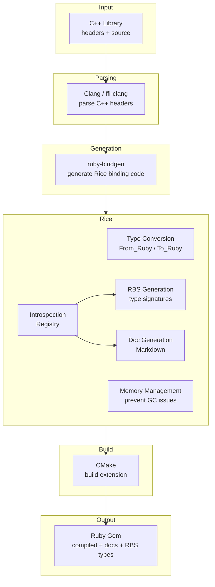

# Ecosystem

Rice is part of a larger ecosystem of tools for wrapping C++ libraries for Ruby. Together, these tools provide a complete pipeline from C++ headers to documented, type-annotated Ruby gems.

## Toolchain

What once took weeks of manual work can now be done in hours.

## Tools

### Clang / ffi-clang

[Clang](https://clang.llvm.org/) is a C/C++ compiler that provides libclang, a library for parsing C++ code. [ffi-clang](https://github.com/ffi/ffi-clang) provides Ruby bindings to libclang, allowing Ruby code to walk the C++ AST (Abstract Syntax Tree) and extract classes, methods, constructors, enums, and other declarations.

### ruby-bindgen

[ruby-bindgen](https://github.com/cfis/ruby-bindgen) uses ffi-clang to parse C++ headers and automatically generates Rice binding code. Point it at a library's headers and it produces correct binding code.

### Rice

Rice wraps C++ code and exposes it to Ruby. It also includes:

- **Introspection API** - Rice tracks every class, method, and attribute it wraps in an internal registry. This metadata is exposed to Ruby, enabling documentation and type generation. See [Registries](ruby_api/registries.md).

- **RBS Generation** - Generate [RBS](https://github.com/ruby/rbs) type signatures for wrapped classes, giving Ruby's type checkers full visibility into your C++ bindings. See [RBS](packaging/rbs.md).

- **API Documentation Generation** - Generate Ruby-style API documentation in Markdown format from wrapped classes. See [Documentation](packaging/documentation.md).

### CMake

[CMake](https://cmake.org/) is the de-facto C++ build system. Rice includes an improved FindRuby.cmake module with fixes that have been upstreamed to CMake itself, making native extension builds work reliably across platforms. See [CMake](packaging/cmake.md).